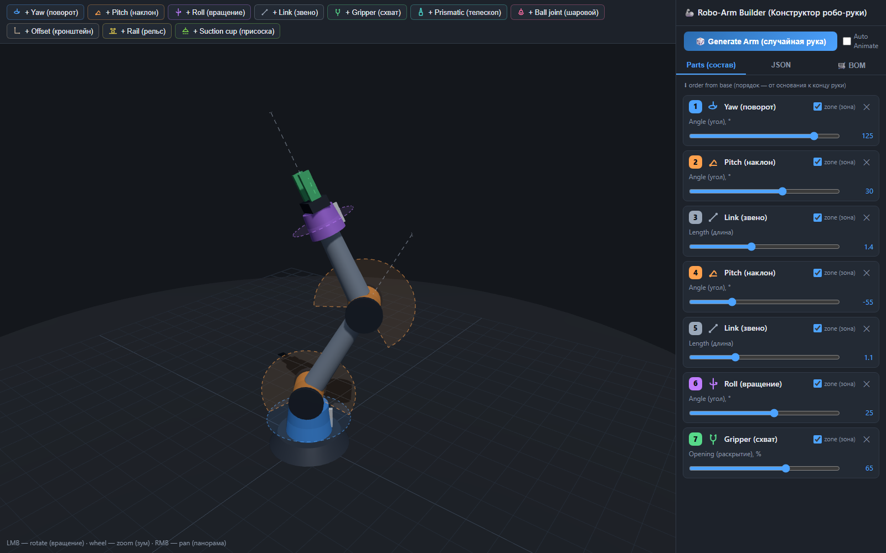

# 🦾 Robo-Arm Builder

**English** · [Русский](README.ru.md)

An interactive 3D constructor for robotic arms, built with [three.js](https://threejs.org/).
The whole project is **a single file, `index.html`** — no server, no build step, no install:
double-click it and it opens in your browser.



## Who this is for

This is made for **complete beginners in robotics** — for people who want to get started but don't
yet know what would actually suit them.

Assemble an arm out of basic components, drag the sliders and watch every joint move, then open the
BOM tab and see what that exact arm would cost in real motors, drivers and hardware. Try a few
configurations and you get a feel for where to enter the field — whether out of curiosity and
self-development, or professional interest.

It is a **sandbox for building intuition before spending money**: not a CAD system, not an assembly
manual, and not a kinematics simulator. Prices and part choices are indicative, meant to give you a
sense of scale — a 3-axis arm versus a 6-axis one with a rail underneath is a difference you can
see here in a couple of clicks.

**A good first arm:** `yaw → pitch → link → pitch → link → roll → gripper`. That's the classic
4-axis manipulator with a gripper — it's the default configuration when you open the page. Remove
the last `roll`, and it gets simpler and cheaper; add a `rail` at the base, and the arm gains reach
but needs a linear rail and one more motor.

## Features

- **Sequential assembly from the base up**: yaw (turntable), pitch (hinge), roll (axial rotation),
  link (segment), prismatic (telescope), ball joint, offset (bracket), rail (linear rail),
  gripper, suction cup.
- **Live control** — a slider for every joint moves the arm in real time.
- **Motion zones** — translucent dashed sectors and lines show each joint's range of travel
  (toggled per component with the *zone* checkbox).
- **JSON configuration** — the arm structure serialises into editable JSON: copy configurations
  you like, paste them back and press Apply.
- **URDF export** — the same arm as a standard ROS robot description: a self-contained `.urdf`
  file with joints, limits, primitive geometry and estimated masses, ready for RViz, MoveIt,
  Gazebo or PyBullet. Copy it or download it from the URDF tab.
- **🎲 Generate Arm** — a random generator that follows the logic of real manipulators.
- **✨ Start New Project** — clears the arm and returns the camera to its starting view, then
  points a hint at the toolbar so you know where to add the first component.
- **Animate** — smooth sinusoidal motion of every joint, toggled in the top-left corner of the
  3D view.
- **Auto camera** — the camera pulls back on its own if the arm grows out of frame.
- **🎯 Inverse kinematics** — switch on *IK* and drag the target at the arm tip: the joints follow.
  A target the arm cannot reach stays red with the missing distance and a hint to rebuild the
  arm (a longer link, another joint, a telescope); as soon as the rebuilt arm reaches it, the
  target is accepted automatically.
- **🏆 Challenge mode** — three tasks for the arm you built, started from the bottom-left button:
  pick up a cube and set it inside a ring, then lift it over the walls of a square; drill the four
  corners marked on a wall; cut a billet in half with the mill. Objects can be grasped, they fall,
  and any part of the arm pushes them; the drill cuts only along its axis, the mill only in its
  plane, and the arm stops at the floor. Every action is recorded: undo the last one, or replay the
  whole sequence — once or in a loop — with the physics running for real.
- **Floor** — the arm and its tool stop at the floor; the auto-animation bounces back from it.
- **Sizes at build time** — the length of a link, a bracket or a telescope body is set while the
  component is the last in the chain and locked once the next one is attached; motion comes from
  joints and the telescope's extension, not from stretching parts.
- **🔗 Share links** — a click on *Share* copies a short link with the arm's structure and sizes
  (easy to remember and dictate); a long press copies the full link with the exact pose as well.
  `?lang=en|ru` and `?theme=dark|light` in a link pick the interface language and theme.
- **🛒 BOM (shopping list)** — a bill of materials computed from the current arm, grouped by the
  component each part belongs to, with a subtotal per group and swappable alternatives for the
  common parts. Above the table is the arm's name in standard nomenclature
  ("4-axis manipulator with gripper").
- **Two themes** — a dark one and a light one in the light-grey tones of 3D editors, switched with
  the moon/sun toggle in the panel header. The 3D viewport, floor, grid and arm parts are recoloured
  along with the interface.
- **Two languages** — English and Russian, switched with the EN/RU toggle in the panel header.
  Both the theme and the language are remembered in the browser.
- **Version number** — shown next to the title in the panel header, so you always know which build
  you are looking at.

## Getting started

Open `index.html` in a browser. The only thing you need an internet connection for is the three.js
CDN (jsdelivr).

**Controls:** LMB — rotate the view · wheel — zoom · RMB — pan.

## Components

| Type | What it is | Parameter | Range |
|---|---|---|---|
| `yaw` | Turntable: rotation around the vertical axis | `angle` | −180…180° |
| `pitch` | Hinge joint: swings the arm up and down | `angle` | −120…120° |
| `roll` | Rotation around the arm's own axis | `angle` | −180…180° |
| `link` | Rigid segment between joints | `length` | 0.3…3 |
| `prismatic` | Telescopic linear actuator | `length`, `ext` | 0.3…2, 0…length |
| `spherical` | Ball joint: two axes in one node | `pitch`, `yaw` | −90…90°, −180…180° |
| `offset` | L-bracket: sideways offset of the axis | `length` | 0.2…1.5 |
| `rail` | Linear rail: the carriage carries everything above it | `pos` | −2…2 |
| `gripper` | Two-finger gripper | `open` | 0…100% |
| `suction` | Vacuum suction cup | `power` | 0…100% |
| `drill` | Drill: spindle with a bit | `speed` | 0…100% |
| `mill` | Mill: spindle with a toothed disc | `speed` | 0…100% |

Components are added in order from the base towards the tip of the arm. `length` parameters are
build-time sizes: editable only while the component is the last one. The machine-readable form of
this table is [`schema.json`](schema.json) (JSON Schema, generated from the type registry).

## JSON format

```json
[
  { "type": "yaw",     "angle": 0 },
  { "type": "pitch",   "angle": 40 },
  { "type": "link",    "length": 1.2 },
  { "type": "roll",    "angle": 0 },
  { "type": "gripper", "open": 60 }
]
```

The JSON tab always mirrors the current arm. Edit it by hand and press **Apply**: unknown component
types are rejected, values are clamped to their allowed range, and missing parameters fall back to
their defaults.

## URDF export

The **URDF** tab mirrors the current arm as a [URDF](http://wiki.ros.org/urdf) robot description —
the format ROS, RViz, MoveIt, Gazebo and PyBullet speak. The file is self-contained: geometry is
built from primitives (cylinders, boxes, spheres), so there are no external meshes to ship with it.

- **Frames.** In the 3D view the arm grows along local +Y; URDF uses +Z, so the export rotates the
  frame by Rx(+90°). Yaw and roll turn around `0 0 1`, pitch around `1 0 0`.
- **Units.** One builder unit = 1 m, angles in radians (the `URDF_SCALE` constant scales the whole
  model if your arm is smaller).
- **Joints.** Every movable component becomes a joint with the same limits as its slider: revolute
  for yaw/pitch/roll, prismatic for the telescope, the rail and the gripper fingers (the right
  finger `mimic`s the left), continuous for the drill and mill spindles. A ball joint has no URDF
  counterpart, so it is exported as two revolute joints sharing an intermediate link. Links and
  offsets are structure, not motion — they shape the link they belong to. The tip carries the
  usual `tool0` frame.
- **Estimates.** Masses, inertia tensors and joint `effort`/`velocity` are computed from primitive
  volumes at a uniform density: enough for visualisation and kinematics, but replace them with real
  numbers from the parts in the BOM before doing dynamics.
- **Pose.** URDF describes a model, not a pose, so the current slider values are listed in the
  header comment — copy them into a `joint_states` message if you need this exact posture.

## For developers

The whole app is one file, `index.html`, with no build step — keep it that way. Node is only
needed for the checks:

```
node tests/check.mjs          # syntax of the JS module
node tests/codec.test.mjs     # link codec, validator and schema.json — in node, no browser
node tests/run.mjs            # headless-Chrome scenarios: challenge physics, IK, replay, links…
node tools/release.mjs X.Y.Z  # version into index.html, CHANGELOG section, git tag
```

Open `index.html?debug=1` to get `window.roboArm` — a small API (`setArm`, `setParam`, `tick`,
`state`, `challenge`, `share`…) for driving the page from the console, Playwright or an agent.
See [`tests/README.md`](tests/README.md), [`CODEC.md`](CODEC.md) for the link format and
[`CHANGELOG.md`](CHANGELOG.md).

## About the shopping list

The list is **grouped by the component each part belongs to** — a Yaw block, a Pitch block, and so
on, in the same order as the arm, each with its own subtotal. Repeated components are merged
(`Pitch ×2`) with quantities multiplied. Last comes the base kit, one per arm: controller, buck
converter, power supply, M3 hardware and one capacitor per stepper driver.

Every rotating axis pulls in a motor, a driver, a bearing to carry the load, and an endstop to home
against, plus a transmission wherever the motor doesn't sit on the axis directly — a belt on the
turret, the roll and the rail, a planetary gearbox on the pitch joints. Linear parts add their guide
and screw; the suction cup adds a solenoid valve and a relay to switch the pump.

**Alternatives:** parts with a dropdown can be swapped for a common substitute — an ESP32 for an
Arduino Mega, a Raspberry Pi Pico, a Pi Zero 2 W or a Pi 4; a NEMA 17 for a NEMA 23 or a hobby
servo; a planetary gearbox for a printed cycloidal drive, a worm gear or a harmonic drive. The
swap changes the name and the price everywhere that part appears, so you can see what a cheaper or
beefier build would cost. It does not change what the arm needs.

Prices are approximate, in USD, at the level of AliExpress listings. Treat the total as an order of
magnitude ("this arm is roughly $150, that one is roughly $400"), not as a quote.
