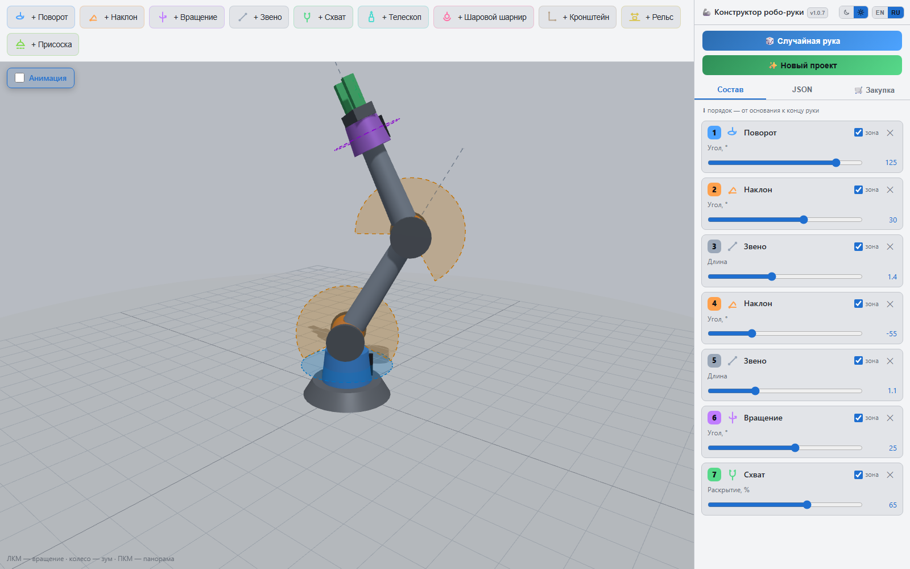

# 🦾 Конструктор робо-руки

[English](README.md) · **Русский**

Интерактивный 3D-конструктор роботизированных манипуляторов на [three.js](https://threejs.org/).
Весь проект — **один файл `index.html`**: без сервера, без сборки, без установки,
открывается двойным кликом в браузере.



## Для кого это

Проект рассчитан на **самых базовых новичков в роботостроении** — на тех, кто хочет с чего-то
начать, но пока даже не знает, что именно ему подойдёт.

Соберите руку из базовых компонентов, подвигайте слайдерами каждый сустав, а потом откройте
вкладку «Закупка» и посмотрите, во что эта конкретная рука обойдётся в реальных моторах,
драйверах и крепеже. Пара-тройка конфигураций — и появляется понимание, с чего можно входить
в тему: для саморазвития или из профессионального интереса.

Это **песочница, чтобы набрать интуицию до того, как тратить деньги**: не CAD, не инструкция по
сборке и не симулятор кинематики. Цены и подбор деталей — ориентировочные, они дают почувствовать
масштаб: разница между 3-осевой рукой и 6-осевой с рельсом в основании видна здесь за пару кликов.

**Хорошая первая рука:** `yaw → pitch → link → pitch → link → roll → gripper`. Это классический
4-осевой манипулятор с захватом — именно он открывается по умолчанию. Уберите последний `roll` —
станет проще и дешевле; добавьте `rail` в основание — рука получит больший охват, но потребует
линейной направляющей и ещё одного мотора.

## Возможности

- **Последовательная сборка от основания**: поворот (турель), наклон (шарнир), вращение вокруг
  своей оси, звено, телескоп, шаровой шарнир, кронштейн, линейный рельс, схват, вакуумная присоска.
- **Живое управление** — слайдер каждого сустава двигает руку в реальном времени.
- **Зоны движения** — полупрозрачные пунктирные секторы и линии показывают диапазон хода каждого
  сустава (включаются галочкой «зона» на компоненте).
- **JSON-конфигурация** — структура руки сериализуется в редактируемый JSON: копируйте удачные
  конфигурации и возвращайте их кнопкой «Применить».
- **Экспорт в URDF** — та же рука в стандартном описании робота для ROS: самодостаточный файл
  `.urdf` с суставами, их пределами, геометрией из примитивов и оценочными массами — для RViz,
  MoveIt, Gazebo или PyBullet. Копируется и скачивается со вкладки URDF.
- **🎲 Случайная рука** — генератор по логике реальных манипуляторов.
- **✨ Новый проект** — очищает руку, возвращает камеру в стартовый вид и показывает подсказку,
  указывающую на панель кнопок: куда нажать, чтобы добавить первый компонент.
- **Анимация** — плавное синусоидальное движение всех суставов, переключатель в левом верхнем
  углу 3D-окна.
- **Авто-камера** — камера сама отъезжает, если рука выходит за кадр.
- **🎯 Обратная кинематика** — включите *ИК* и тяните мишень на конце руки: суставы подберутся
  сами. Недостижимая цель остаётся красной, подсказка называет недостающее расстояние и
  предлагает перестроить руку (длиннее звено, ещё сустав, телескоп); как только перестроенная
  рука дотягивается, цель принимается автоматически.
- **🏆 Режим заданий** — три задачи для собранной руки, кнопка внизу слева: взять кубик и
  поставить в кольцо, затем перенести через стенки в квадрат; просверлить четыре размеченных
  угла на стене; распилить чушку пополам фрезой. Предметы берутся схватом, падают, любая деталь
  руки их толкает; сверло режет только вдоль оси, фреза только в своей плоскости, об пол рука
  останавливается. Все действия записываются: можно отменить последнее или проиграть всю
  последовательность — однократно или по кругу — с настоящей физикой.
- **Пол** — рука и инструмент об пол останавливаются, авто-анимация от него разворачивается.
- **Габариты при сборке** — длина звена, кронштейна и корпуса телескопа задаётся, пока компонент
  последний в цепочке, и блокируется, как только добавлен следующий; движение дают суставы и
  выдвижение телескопа, а не растяжение деталей.
- **🔗 Ссылки** — клик по «Ссылке» копирует короткую ссылку с составом и размерами руки (легко
  запомнить и продиктовать), долгое нажатие — полную, ещё и с точной позой. Параметры
  `?lang=en|ru` и `?theme=dark|light` в ссылке задают язык и тему интерфейса.
- **🛒 Закупка (BOM)** — спецификация по текущей руке, сгруппированная по компонентам, к которым
  относятся детали, с подсуммой на группу и выпадающими списками замен для распространённых
  позиций. Над таблицей — название руки в принятой номенклатуре
  («4-осевой манипулятор с захватом»).
- **Две темы** — тёмная и светлая, в светло-серых тонах 3D-редакторов; переключатель «луна/солнце»
  в шапке панели. Вместе с интерфейсом перекрашиваются 3D-сцена, пол, сетка и детали руки.
- **Два языка** — English и Русский, переключатель EN/RU в шапке панели. И тема, и язык
  запоминаются в браузере.
- **Номер версии** — рядом с заголовком в шапке панели: всегда видно, какая сборка перед вами.

## Запуск

Откройте `index.html` в браузере. Интернет нужен только для CDN three.js (jsdelivr).

**Управление:** ЛКМ — вращение вида · колесо — зум · ПКМ — панорама.

## Компоненты

| Тип | Что это | Параметр | Диапазон |
|---|---|---|---|
| `yaw` | Турель: поворот вокруг вертикальной оси | `angle` | −180…180° |
| `pitch` | Шарнир: наклон руки вверх-вниз | `angle` | −120…120° |
| `roll` | Вращение вокруг собственной оси руки | `angle` | −180…180° |
| `link` | Жёсткое звено между суставами | `length` | 0.3…3 |
| `prismatic` | Телескопический линейный привод | `length`, `ext` | 0.3…2, 0…length |
| `spherical` | Шаровой шарнир: две оси в одном узле | `pitch`, `yaw` | −90…90°, −180…180° |
| `offset` | Г-образный кронштейн: боковое смещение оси | `length` | 0.2…1.5 |
| `rail` | Линейный рельс: каретка несёт всё, что выше | `pos` | −2…2 |
| `gripper` | Двухпальцевый схват | `open` | 0…100% |
| `suction` | Вакуумная присоска | `power` | 0…100% |
| `drill` | Сверло: шпиндель с буром | `speed` | 0…100% |
| `mill` | Фреза: шпиндель с зубчатым диском | `speed` | 0…100% |

Компоненты добавляются по порядку — от основания к концу руки.

Параметры `length` — габариты сборки: редактируются, только пока компонент последний.
Машиночитаемый вариант таблицы — [`schema.json`](schema.json) (JSON Schema, генерируется из реестра
типов).

## Формат JSON

```json
[
  { "type": "yaw",     "angle": 0 },
  { "type": "pitch",   "angle": 40 },
  { "type": "link",    "length": 1.2 },
  { "type": "roll",    "angle": 0 },
  { "type": "gripper", "open": 60 }
]
```

Вкладка JSON всегда отражает текущую руку. Правьте её руками и жмите **«Применить»**: неизвестные
типы компонентов отбрасываются с ошибкой, значения зажимаются в допустимый диапазон, пропущенные
параметры берутся из значений по умолчанию.

## Экспорт в URDF

Вкладка **URDF** отражает текущую руку в формате [URDF](http://wiki.ros.org/urdf) — описании
робота, на котором говорят ROS, RViz, MoveIt, Gazebo и PyBullet. Файл самодостаточен: геометрия
собрана из примитивов (цилиндры, кубы, шары), внешние меши не нужны.

- **Оси.** В 3D-виде рука растёт вдоль локального +Y, в URDF — вдоль +Z, поэтому экспорт
  разворачивает систему на Rx(+90°). Поворот и вращение идут вокруг `0 0 1`, наклон — вокруг
  `1 0 0`.
- **Единицы.** Одна единица конструктора = 1 м, углы в радианах (константа `URDF_SCALE` масштабирует
  всю модель, если ваша рука меньше).
- **Суставы.** Каждый подвижный компонент становится суставом с пределами своего слайдера: revolute
  для поворота/наклона/вращения, prismatic для телескопа, рельса и пальцев схвата (правый палец
  повторяет левый через `mimic`), continuous для шпинделей сверла и фрезы. Шарового сустава в URDF
  нет — он выгружается парой revolute с промежуточным звеном. Звено и кронштейн — статика: они
  формируют то звено, к которому относятся. На конце руки — привычная точка `tool0`.
- **Оценки.** Массы, тензоры инерции и `effort`/`velocity` суставов посчитаны по объёму примитивов
  при равномерной плотности: для визуализации и кинематики этого хватает, но перед расчётом
  динамики замените их настоящими — из деталей вкладки «Закупка».
- **Поза.** URDF описывает модель, а не позу, поэтому текущие значения слайдеров вынесены в
  комментарий-шапку: оттуда их можно перенести в `joint_states`.

## Разработчикам

Всё приложение — один файл `index.html` без сборки, и это осознанное ограничение. Node нужен
только для проверок:

```
node tests/check.mjs          # синтаксис JS-модуля
node tests/codec.test.mjs     # кодек ссылок, валидатор и schema.json — в node, без браузера
node tests/run.mjs            # сценарии в headless Chrome: физика заданий, ИК, повтор, ссылки…
node tools/release.mjs X.Y.Z  # версия в index.html, раздел CHANGELOG, git-тег
```

Откройте `index.html?debug=1` — появится `window.roboArm`, небольшой API (`setArm`, `setParam`,
`tick`, `state`, `challenge`, `share`…) для управления страницей из консоли, Playwright или агента.
Подробнее: [`tests/README.md`](tests/README.md), формат ссылок — [`CODEC.md`](CODEC.md), история —
[`CHANGELOG.md`](CHANGELOG.md).

## Про список закупки

Список **сгруппирован по компонентам, к которым относятся детали**: блок «Поворот», блок «Наклон»
и так далее — в том же порядке, что и рука, каждый со своей подсуммой. Повторяющиеся компоненты
сводятся в одну группу («Наклон ×2») с умножением количеств. В конце — базовый комплект, один на
руку: контроллер, преобразователь, блок питания, крепёж и по конденсатору на каждый драйвер.

Каждая вращающаяся ось тянет за собой мотор, драйвер, подшипник под нагрузку и концевик для
базирования, плюс передачу там, где мотор не сидит на оси напрямую: ремень на турели, вращении
и рельсе, планетарный редуктор на наклонах. Линейные узлы добавляют направляющую и винт,
присоска — электромагнитный клапан и реле для управления насосом.

**Замены:** у деталей со списком можно выбрать распространённый аналог — ESP32 на Arduino Mega,
Raspberry Pi Pico, Pi Zero 2 W или Pi 4; NEMA 17 на NEMA 23 или хобби-сервопривод; планетарный
редуктор на печатный циклоидальный, червячный или волновой. Замена меняет название и цену во всех
строках с этой деталью — видно, во что обойдётся более дешёвая или более мощная сборка. На состав
руки замена не влияет.

Цены ориентировочные, в USD, на уровне объявлений AliExpress. Итог стоит читать как порядок величины
(«эта рука — примерно $150, а та — примерно $400»), а не как коммерческое предложение.
